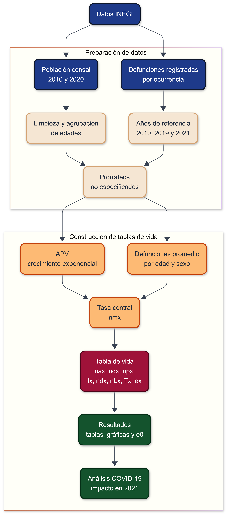
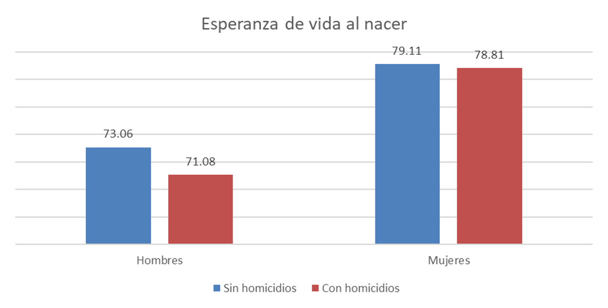
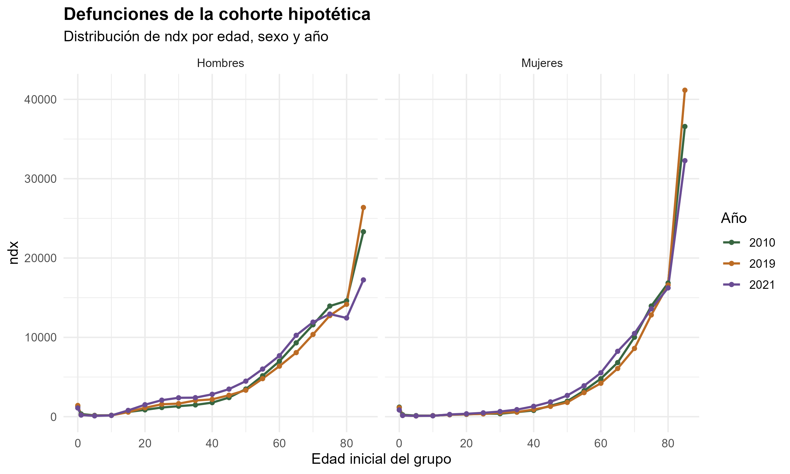
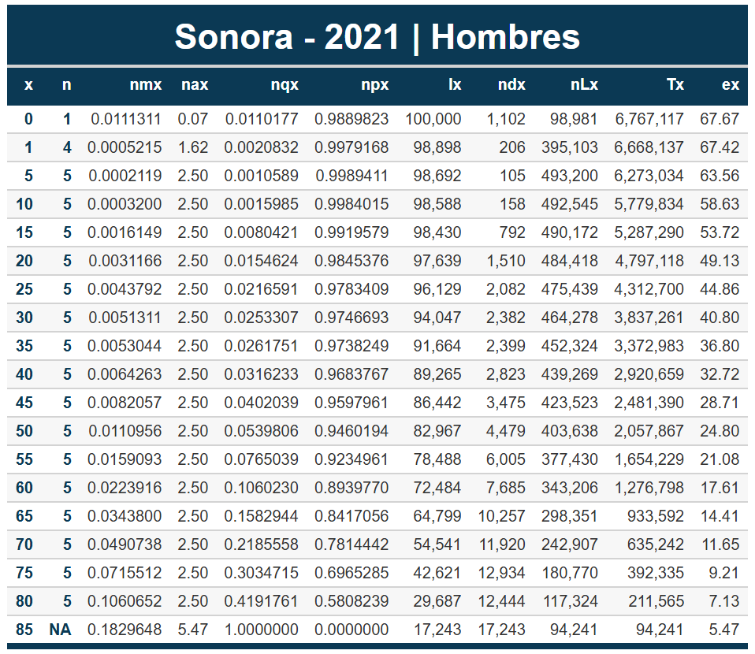
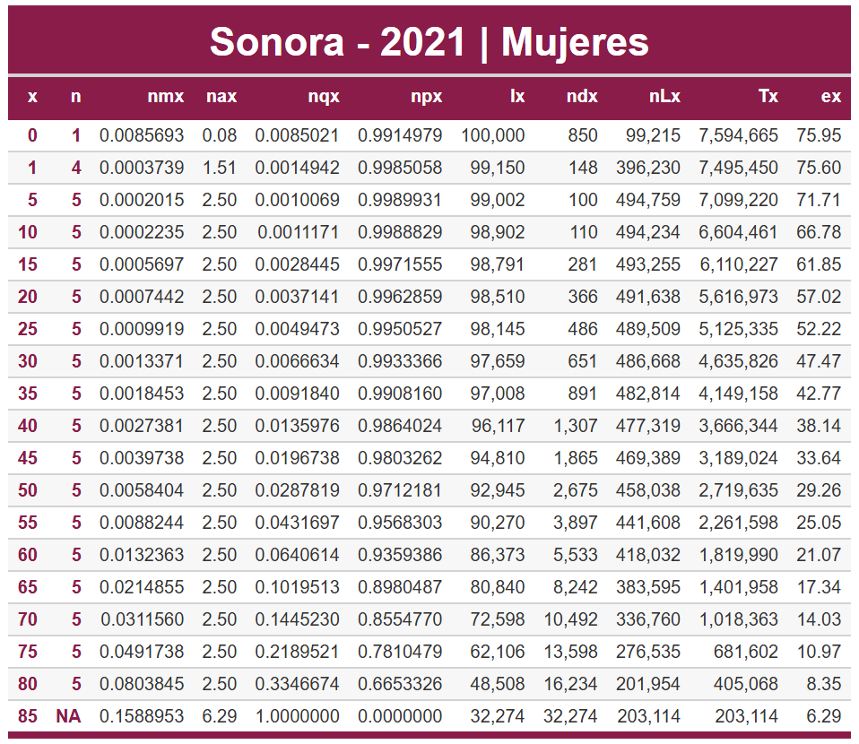
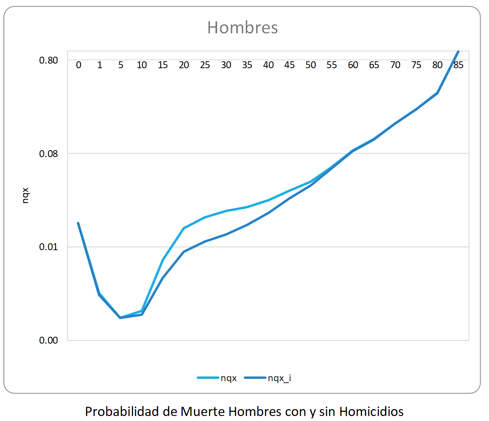
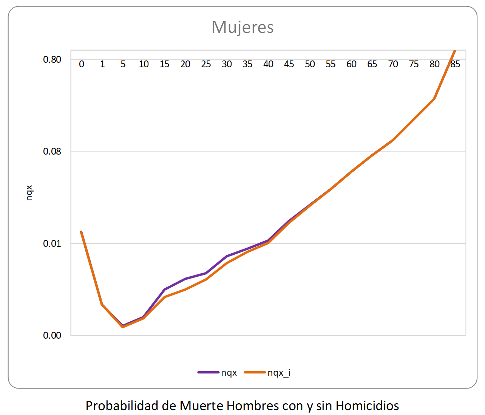
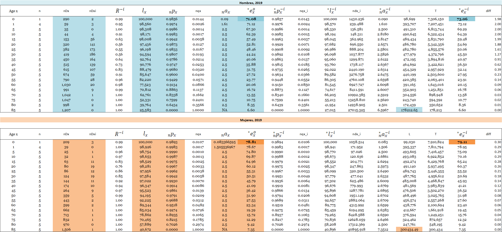

## a) Contexto de la entidad federativa

Sonora es una entidad ubicada en el noroeste de México, con características territoriales, climáticas y demográficas particulares. Su extensión territorial es amplia, su clima es predominantemente árido y semiárido, y una parte importante de su población se concentra en municipios urbanos como Hermosillo, Cajeme, Nogales, San Luis Río Colorado y Guaymas. Estas condiciones son relevantes para el análisis de la mortalidad, ya que la distribución territorial de la población puede influir en el acceso a servicios médicos, hospitales, traslados y atención oportuna.

Una característica central de Sonora es su condición fronteriza con Estados Unidos. Esta situación genera una dinámica particular de movilidad, comercio, empleo e intercambio poblacional, especialmente en municipios del norte como Nogales, Agua Prieta y San Luis Río Colorado. Dicha movilidad puede modificar la estructura por edad y sexo de la población, sobre todo en edades laborales, por lo que debe considerarse al interpretar las tasas de mortalidad, la población expuesta al riesgo y los indicadores de fecundidad.

De acuerdo con el Censo de Población y Vivienda 2020, Sonora tenía 2,944,840 habitantes y una edad mediana de 30 años. Esto indica que la entidad aún conserva una estructura relativamente joven, aunque también muestra señales de envejecimiento demográfico. Este proceso es importante porque, conforme aumenta el peso de las edades adultas y avanzadas, también se incrementa la concentración de defunciones y cambian indicadores como (nM_x), (nq_x) y la esperanza de vida. Al mismo tiempo, la evolución de la fecundidad permite observar si la entidad mantiene niveles cercanos o inferiores al reemplazo generacional.

Otro elemento relevante es el clima. Las altas temperaturas en distintas regiones del estado pueden representar un riesgo adicional para ciertos grupos de población, especialmente personas adultas mayores o personas con enfermedades crónicas. Aunque una tabla de vida no explica directamente las causas de muerte, el contexto ambiental ayuda a interpretar posibles diferencias en los patrones de mortalidad respecto a entidades con condiciones climáticas menos extremas.

Además, en el caso de Sonora resulta importante considerar la mortalidad por homicidios, especialmente porque esta causa puede afectar con mayor intensidad a ciertos grupos de edad y sexo, principalmente hombres jóvenes y adultos. Por ello, la tabla de vida de 2019 con causa eliminada permite comparar la mortalidad observada con un escenario hipotético sin homicidios, y evaluar cuánto cambia la esperanza de vida al nacer y las probabilidades de morir por edad.

Finalmente, el año 2021 es central en el análisis debido al impacto de la pandemia de COVID-19. Al comparar 2010, 2019 y 2021, el año 2010 permite observar una situación previa de referencia, 2019 representa el escenario inmediato anterior a la pandemia y 2021 refleja el efecto del aumento extraordinario de la mortalidad. En este sentido, se espera que las tablas de vida muestren una disminución en la esperanza de vida al nacer, con diferencias entre hombres y mujeres y con un mayor impacto en edades adultas y avanzadas.

## b) Diagrama de flujo del proceso

El siguiente diagrama resume el procedimiento seguido para construir las tablas de vida de Sonora para los años 2010, 2019 y 2021, separadas por sexo. El proceso inicia con la obtención de datos censales y de defunciones registradas; posteriormente se realiza la limpieza y organización de las bases, el cálculo de la población expuesta al riesgo y, finalmente, la construcción de las funciones de la tabla de vida.

```{r}
#| echo: false
#| message: false
#| warning: false
#| fig-align: center
#| out-width: "115%"


```

El flujo permite distinguir cuatro etapas principales: los insumos de información, la preparación de datos, el cálculo actuarial-demográfico y la generación de resultados. Esta separación facilita la reproducibilidad del proyecto, ya que cada etapa corresponde a una parte específica del código utilizado.

## c) Fórmulas utilizadas

En esta sección se presentan las expresiones empleadas para estimar las tablas de vida de Sonora y los indicadores de fecundidad. La idea general fue transformar la información básica de población y defunciones en funciones demográficas que permitan comparar la mortalidad por edad, sexo y año. Posteriormente, se incorporó el ejercicio de causa eliminada por homicidios para 2019 y el cálculo de indicadores reproductivos para 2010 y 2019.

### Población base para el cálculo de tasas

Para estimar tasas de mortalidad se requiere una aproximación de la población expuesta al riesgo en cada grupo de edad. Debido a que la información censal no está disponible para todos los años del análisis, se utilizó una interpolación basada en crecimiento exponencial.

La población estimada en el año (t) se obtuvo mediante:

$$
N(t)=N_0e^{r(t-t_0)}
$$

donde (N_0) es la población observada al inicio del periodo, (N(t)) es la población estimada para el año requerido, (t_0) es el año inicial y (r) representa el ritmo de crecimiento entre los dos levantamientos censales.

La tasa de crecimiento se calculó como:

$$
r=\frac{\ln(N_T/N_0)}{t_T-t_0}
$$

donde (N_T) corresponde a la población observada en el año final (t_T). Con este procedimiento se obtuvo la población expuesta al riesgo, denotada como ({}\_nAPV_x), para cada sexo, año y grupo de edad.

### Defunciones de referencia

Antes de construir las tasas, las defunciones se organizaron por año, sexo y grupo de edad. Para evitar que un solo año reflejara fluctuaciones accidentales, se utilizaron promedios alrededor de los años de interés.

De forma general, la defunción de referencia se expresó como:

$$
D_x^{ref}=\frac{1}{k}\sum_{j=1}^{k}D_{x,j}
$$

donde (k) es el número de años considerados en el promedio. Para este trabajo se usaron las siguientes ventanas:

$$
D_x^{2010}=\frac{D_x^{2009}+D_x^{2010}+D_x^{2011}}{3}
$$

$$
D_x^{2019}=\frac{D_x^{2018}+D_x^{2019}}{2}
$$

$$
D_x^{2021}=\frac{D_x^{2020}+D_x^{2021}+D_x^{2022}}{3}
$$

Estos valores fueron la base para calcular las tasas centrales de mortalidad.

### Tasas centrales de mortalidad

La primera función de mortalidad estimada fue la tasa central. Esta mide la intensidad de la mortalidad dentro de un intervalo de edad y se obtuvo al dividir las defunciones entre la población expuesta:

$$
{}_nm_x=\frac{{}_nD_x}{{}_nAPV_x}
$$

Aquí, ({}\_nD_x) representa las defunciones ocurridas entre las edades (x) y (x+n), mientras que ({}\_nAPV_x) representa la población expuesta al riesgo en ese mismo intervalo.

### Tiempo vivido por las personas que fallecen

Para convertir tasas centrales en probabilidades de muerte se necesita el valor ({}\_na_x), que aproxima el tiempo promedio vivido dentro del intervalo por quienes fallecen.

En los grupos quinquenales cerrados se utilizó la aproximación usual:

$$
{}_na_x=\frac{n}{2}
$$

Esto supone que, dentro del intervalo, las defunciones se distribuyen aproximadamente a la mitad del periodo.

Para la edad 0 y para el grupo de 1 a 4 años se utilizaron las expresiones de Coale-Demeny vistas en clase, ya que en las primeras edades la mortalidad no se distribuye de forma uniforme.

Para hombres:

$$
a_0=0.330 \quad \text{si } m_0\geq 0.107
$$

$$
a_0=0.045+2.684m_0 \quad \text{si } m_0<0.107
$$

$$
a_1=1.352 \quad \text{si } m_0\geq 0.107
$$

$$
a_1=1.651-2.816m_0 \quad \text{si } m_0<0.107
$$

Para mujeres:

$$
a_0=0.350 \quad \text{si } m_0\geq 0.107
$$

$$
a_0=0.053+2.800m_0 \quad \text{si } m_0<0.107
$$

$$
a_1=1.361 \quad \text{si } m_0\geq 0.107
$$

$$
a_1=1.522-1.518m_0 \quad \text{si } m_0<0.107
$$

### Conversión de tasas en probabilidades

Una vez obtenidas las tasas centrales, se calcularon las probabilidades de morir en cada intervalo de edad. Para los grupos cerrados se usó:

$$
{}_nq_x=
\frac{n\cdot {}_nm_x}
{1+(n-{}_na_x)\cdot {}_nm_x}
$$

donde ({}\_nq_x) es la probabilidad de que una persona que llega viva a la edad exacta (x) fallezca antes de cumplir (x+n).

La probabilidad complementaria, es decir, la probabilidad de sobrevivir al intervalo, fue:

$$
{}_np_x=1-{}_nq_x
$$

Para el intervalo abierto final se fijó:

$$
{}_{\omega}q_x=1
$$

Esto significa que, al tratarse del último grupo de edad, la probabilidad de morir dentro de ese intervalo se considera igual a uno.

### Cohorte hipotética de la tabla de vida

La tabla de vida se construyó a partir de una cohorte inicial de cien mil nacimientos:

$$
l_0=100000
$$

Con esta raíz, se estimó cuántas personas sobreviven al inicio de cada grupo de edad. La relación recursiva fue:

$$
l_{x+n}=l_x\cdot {}_np_x
$$

donde (l_x) indica el número de sobrevivientes a la edad exacta (x).

Las muertes dentro de cada intervalo de la cohorte se calcularon como:

$$
{}_nd_x=l_x\cdot {}_nq_x
$$

También se verifican mediante la diferencia entre sobrevivientes consecutivos:

$$
{}*nd_x=l_x-l*{x+n}
$$

### Años persona y acumulación de la sobrevivencia

Después de obtener sobrevivientes y defunciones, se calcularon los años persona vividos por la cohorte en cada intervalo:

$$
{}*nL_x=n\cdot l*{x+n}+{}_na_x\cdot {}_nd_x
$$

En el grupo abierto final se aplicó:

$$
{}*{\omega}L_x=\frac{l_x}{{}*{\omega}m_x}
$$

Posteriormente, los años persona restantes a partir de cada edad se obtuvieron mediante la suma acumulada hacia atrás:

$$
T_x=\sum_{y=x}^{\omega}{}_nL_y
$$

### Esperanza de vida

La esperanza de vida a la edad exacta (x) se calculó dividiendo los años persona restantes entre los sobrevivientes a esa edad:

$$
e_x^0=\frac{T_x}{l_x}
$$

El indicador principal del análisis fue la esperanza de vida al nacer:

$$
e_0^0=\frac{T_0}{l_0}
$$

Este valor resume el nivel de mortalidad de cada tabla y permite comparar los resultados entre hombres y mujeres, así como entre los años 2010, 2019 y 2021.

### Tabla de vida sin homicidios

Además de las tablas generales, se construyó una tabla de vida para 2019 eliminando la causa de muerte por homicidios. El objetivo fue estimar cómo cambiarían las funciones de mortalidad si dicha causa no estuviera presente.

Sea (i) la causa homicidios. Las defunciones totales del intervalo se denotan por ({}\_nD_x), mientras que las defunciones asociadas a homicidios se representan como ({}\_nD_x\^i).

Primero se calculó la parte de la mortalidad que corresponde al resto de causas:

$$
R^{-i}=\frac{{}_nD_x-{}_nD_x^i}{{}_nD_x}
$$

Lo anterior también puede escribirse como:

$$
R^{-i}=1-\frac{{}_nD_x^i}{{}_nD_x}
$$

Con este factor se ajustó la probabilidad de sobrevivencia observada:

$$
{}_np_x^{-i}=({}_np_x)^{R^{-i}}
$$

A partir de esta sobrevivencia ajustada, la nueva probabilidad de morir fue:

$$
{}_nq_x^{-i}=1-{}_np_x^{-i}
$$

Con ({}\_nq_x\^{-i}) se volvió a construir la tabla de vida, manteniendo la misma lógica de cálculo:

$$
l_{x+n}^{-i}=l_x^{-i}\cdot {}_np_x^{-i}
$$

$$
{}_nd_x^{-i}=l_x^{-i}\cdot {}_nq_x^{-i}
$$

$$
{}*nL_x^{-i}=n\cdot l*{x+n}^{-i}+{}_na_x\cdot {}_nd_x^{-i}
$$

$$
T_x^{-i}=\sum_{y=x}^{\omega}{}_nL_y^{-i}
$$

$$
e_x^{-i}=\frac{T_x^{-i}}{l_x^{-i}}
$$

Finalmente, el cambio en la esperanza de vida al nacer se resumió mediante:

$$
\Delta e_0=e_0^{-i}-e_0
$$

donde (e_0\^{-i}) es la esperanza de vida al nacer sin homicidios y (e_0) es la esperanza de vida observada.

### Tasas específicas de fecundidad

Para la parte de fecundidad se trabajó con nacimientos clasificados por edad de la madre y con población femenina por grupo de edad. La Tasa Específica de Fecundidad por Edad se calculó como:

$$
{}_5f_x=\frac{{}_5B_x}{{}_5P_x^F}
$$

donde ({}\_5B_x) son los nacimientos de madres entre (x) y (x+5), y ({}\_5P_x\^F) es la población femenina expuesta en ese mismo intervalo.

Cuando se presenta por cada mil mujeres, se expresa como:

$$
{}_5f_x^{(1000)}={}_5f_x\cdot 1000
$$

Para los cálculos de TGF, TBR y TNR se utilizó la tasa en forma decimal.

### Tasa Global de Fecundidad

La Tasa Global de Fecundidad aproxima el número promedio de hijos que tendría una mujer si durante su vida reproductiva experimentara las tasas específicas observadas en un año determinado.

Como se utilizaron grupos quinquenales de edad, el cálculo fue:

$$
TGF=5\sum_{x=15}^{45}{}_5f_x
$$

De manera desarrollada:

$$
TGF=5({}*5f*{15}+{}*5f*{20}+{}*5f*{25}+{}*5f*{30}+{}*5f*{35}+{}*5f*{40}+{}*5f*{45})
$$

### Tasa Bruta de Reproducción

La Tasa Bruta de Reproducción convierte la fecundidad total en nacimientos femeninos esperados. Es decir, estima cuántas hijas tendría una mujer si no se considerara la mortalidad femenina.

Se calculó como:

$$
TBR=K\cdot TGF
$$

donde (K) es la proporción de nacimientos femeninos. Considerando una razón de 105 hombres por cada 100 mujeres al nacimiento:

$$
K=\frac{100}{205}=0.4878
$$

### Tasa Neta de Reproducción

La Tasa Neta de Reproducción agrega el efecto de la mortalidad femenina. Por ello, mide el número promedio de hijas que tendría una mujer considerando tanto la fecundidad como la sobrevivencia durante las edades reproductivas.

Su cálculo fue:

$$
TNR=
5K\sum_{x=15}^{45}{}_5f_x\cdot
\frac{{}_5L_x^F}{5l_0}
$$

donde ({}\_5L_x\^F) proviene de la tabla de vida femenina y representa los años persona vividos entre (x) y (x+5). La cantidad (l_0) corresponde a la raíz de la tabla de vida.

### Tasa de reemplazo

El reemplazo generacional ocurre cuando, en promedio, cada mujer deja una hija que logra sobrevivir hasta las edades reproductivas. En términos de la Tasa Neta de Reproducción, esto se expresa como:

$$
TNR=1
$$

La TNR puede escribirse de manera aproximada como el producto entre la Tasa Bruta de Reproducción y una probabilidad promedio de sobrevivencia femenina hasta las edades reproductivas:

$$
TNR=p(A)\cdot TBR
$$

donde (p(A)) representa dicha sobrevivencia. Al imponer la condición de reemplazo:

$$
1=p(A)\cdot TBR
$$

por lo tanto:

$$
TBR=\frac{1}{p(A)}
$$

Como la Tasa Bruta de Reproducción se relaciona con la Tasa Global de Fecundidad mediante:

$$
TBR=K\cdot TGF
$$

entonces:

$$
K\cdot TGF=\frac{1}{p(A)}
$$

Despejando:

$$
TGF=\frac{1}{p(A)\cdot K}
$$

Si se toma (K=0.4878) y una sobrevivencia femenina aproximada de (p(A)=0.98), se obtiene:

$$
TGF=\frac{1}{0.98(0.4878)}
$$

$$
TGF\approx 2.09
$$

Por ello, la tasa de reemplazo suele aproximarse a:

$$
TGF\approx 2.1
$$

La interpretación es que dos hijos por mujer no bastan exactamente para asegurar el reemplazo, porque no todos los nacimientos son mujeres y porque existe mortalidad femenina antes o durante las edades reproductivas.

## d) Código utilizado para los cálculos

El proyecto se organizó en scripts separados para que el procedimiento fuera más claro y replicable. El cálculo completo se encuentra en la carpeta `script/`, pero a continuación se muestran los fragmentos principales usados para la construcción de las tablas de vida.

Primero se cargan y preparan los datos de población y defunciones:

```{r}
#| eval: false

source("script/01_preparacion_datos.R")
```

En la preparación de población se agruparon las edades en los intervalos usados para la tabla de vida abreviada:

```{r}
#| eval: false

edad_inicio <- function(x) {
  x <- stringr::str_trim(as.character(x))
  
  dplyr::case_when(
    stringr::str_detect(x, "Menores de 1") | stringr::str_detect(x, "^0 A") ~ 0,
    stringr::str_detect(x, "1-4|1 a 4") ~ 1,
    stringr::str_detect(x, "5 a 9|5-9") ~ 5,
    stringr::str_detect(x, "10 a 14|10-14") ~ 10,
    stringr::str_detect(x, "15 a 19|15-19") ~ 15,
    stringr::str_detect(x, "20 a 24|20-24") ~ 20,
    stringr::str_detect(x, "25 a 29|25-29") ~ 25,
    stringr::str_detect(x, "30 a 34|30-34") ~ 30,
    stringr::str_detect(x, "35 a 39|35-39") ~ 35,
    stringr::str_detect(x, "40 a 44|40-44") ~ 40,
    stringr::str_detect(x, "45 a 49|45-49") ~ 45,
    stringr::str_detect(x, "50 a 54|50-54") ~ 50,
    stringr::str_detect(x, "55 a 59|55-59") ~ 55,
    stringr::str_detect(x, "60 a 64|60-64") ~ 60,
    stringr::str_detect(x, "65 a 69|65-69") ~ 65,
    stringr::str_detect(x, "70 a 74|70-74") ~ 70,
    stringr::str_detect(x, "75 a 79|75-79") ~ 75,
    stringr::str_detect(x, "80 a 84|80-84") ~ 80,
    stringr::str_detect(x, "85") ~ 85,
    stringr::str_detect(x, "^1 A|^2 A|^3 A|^4 A") ~ 1,
    TRUE ~ NA_real_
  )
}
```

Para las defunciones se trabajó con el año de ocurrencia y se construyeron años de referencia para suavizar fluctuaciones:

```{r}
#| eval: false

def_larga[, anio := dplyr::case_when(
  anio_ocurrencia %in% c(2009, 2010, 2011) ~ 2010,
  anio_ocurrencia %in% c(2018, 2019) ~ 2019,
  anio_ocurrencia %in% c(2020, 2021, 2022) ~ 2021,
  TRUE ~ NA_real_
)]

defunciones <- def_larga[
  !is.na(anio),
  .(defunciones = mean(defunciones, na.rm = TRUE)),
  by = .(anio, sexo, edad)
]
```

Después se calcularon los APV mediante crecimiento exponencial:

```{r}
#| eval: false

estimar_exp <- function(p0, p1, fecha0, fecha1, fecha_objetivo) {
  t0 <- a_decimal(fecha0)
  t1 <- a_decimal(fecha1)
  r <- log(p1 / p0) / (t1 - t0)
  p0 * exp(r * (fecha_objetivo - t0))
}
```

Con las defunciones y los APV se calculó la tasa central de mortalidad:

```{r}
#| eval: false

base_mortalidad <- merge(
  apv,
  defunciones,
  by = c("anio", "sexo", "edad"),
  all.x = TRUE
)

base_mortalidad[is.na(defunciones), defunciones := 0]

base_mortalidad[, nmx := defunciones / apv]
```

Finalmente, se construyeron las principales funciones de la tabla de vida:

```{r}
#| eval: false

nqx <- (n * nmx) / (1 + (n - nax) * nmx)
nqx[length(nqx)] <- 1

npx <- 1 - nqx

lx <- rep(NA_real_, length(x))
lx[1] <- 100000

for (i in 2:length(x)) {
  lx[i] <- lx[i - 1] * npx[i - 1]
}

ndx <- lx * nqx

for (i in 1:(length(x) - 1)) {
  nLx[i] <- n[i] * lx[i + 1] + nax[i] * ndx[i]
}

nLx[length(x)] <- lx[length(x)] / nmx[length(nmx)]

Tx <- rev(cumsum(rev(nLx)))

ex <- Tx / lx
```

Estos fragmentos resumen los cálculos principales. El código completo se encuentra en los scripts `01_preparacion_datos.R`, `02_tablas_vida.R` y `03_visualizacion.R`.

## e) Esperanza de vida al nacer por sexo y año

La esperanza de vida al nacer, (e_0\^0), resume el nivel general de mortalidad de cada año y sexo. En este proyecto se calculó a partir de las tablas de vida construidas para Sonora en 2010, 2019 y 2021. Además, para 2019 se incorporó una comparación adicional con la tabla de vida de causa eliminada por homicidios, con el fin de observar cómo cambiaría este indicador en ausencia de dicha causa de muerte.

```{r}
#| echo: false
#| message: false
#| warning: false
#| fig-align: center
#| out-width: "80%"

knitr::include_graphics("output/tablas_vida/resumen_esperanza_vida_sonora.png")
```

El cuadro anterior presenta la esperanza de vida al nacer para hombres y mujeres en cada año de análisis. Esta comparación permite observar las diferencias por sexo y el cambio entre el periodo previo a la pandemia y el año 2021.

```{r}
#| echo: false
#| message: false
#| warning: false
#| fig-align: center
#| out-width: "85%"

knitr::include_graphics("output/graficas/05_cambio_acumulado_esperanza_vida.png")
```

La gráfica toma 2010 como año base, por lo que el valor de ese año se fija en cero. De esta forma se observa con mayor claridad si la esperanza de vida aumentó o disminuyó respecto al inicio del periodo. En particular, el cambio entre 2019 y 2021 permite identificar el efecto del aumento de la mortalidad durante la pandemia de COVID-19.

```{r}
#| echo: false
#| message: false
#| warning: false
#| fig-align: center
#| out-width: "75%"


```

La gráfica anterior compara la esperanza de vida observada en 2019 con la esperanza de vida estimada al eliminar las defunciones por homicidios. Este ejercicio no representa una predicción real, sino un escenario hipotético que permite medir la contribución de dicha causa al nivel general de mortalidad. Si la esperanza de vida sin homicidios es mayor que la observada, la diferencia puede interpretarse como la ganancia potencial en años de vida asociada a la eliminación de esta causa.

Este contraste es especialmente relevante por sexo, ya que los homicidios suelen afectar con mayor intensidad a los hombres en edades jóvenes y adultas. Por ello, la comparación entre la tabla observada y la tabla con causa eliminada permite identificar si el impacto de los homicidios sobre (e_0\^0) es más marcado en hombres que en mujeres.

## f) Gráficas del informe

Para complementar las tablas de vida, se presentan algunas funciones que permiten observar el comportamiento de la mortalidad por edad, sexo y año. En particular, se muestran las tasas centrales de mortalidad, las probabilidades de muerte, la función de sobrevivientes y las defunciones de la cohorte hipotética. Estas gráficas permiten comparar los resultados de Sonora entre 2010, 2019 y 2021, así como identificar diferencias entre hombres y mujeres.

```{r}
#| echo: false
#| message: false
#| warning: false
#| fig-align: center
#| out-width: "90%"

knitr::include_graphics("output/graficas/01_tasas_centrales_mortalidad.png")
```

La gráfica de ({}\_nm_x) muestra la intensidad de la mortalidad por edad. Se presenta en escala logarítmica para observar mejor los cambios en edades jóvenes y adultas, ya que las tasas suelen aumentar de forma importante en edades avanzadas.

```{r}
#| echo: false
#| message: false
#| warning: false
#| fig-align: center
#| out-width: "90%"

knitr::include_graphics("output/graficas/02_probabilidades_muerte.png")
```

La gráfica de ({}\_nq_x) presenta las probabilidades de muerte dentro de cada intervalo de edad. Esta medida permite comparar directamente el riesgo de fallecimiento entre hombres y mujeres, así como entre los años 2010, 2019 y 2021.

```{r}
#| echo: false
#| message: false
#| warning: false
#| fig-align: center
#| out-width: "90%"

knitr::include_graphics("output/graficas/03_sobrevivientes_lx.png")
```

La función (l_x) representa los sobrevivientes de una cohorte hipotética de 100,000 nacimientos. Su trayectoria permite observar cómo se reduce la cohorte conforme aumenta la edad y cómo cambian las condiciones de supervivencia entre años.

```{r}
#| echo: false
#| message: false
#| warning: false
#| fig-align: center
#| out-width: "90%"


```

La gráfica de ({}\_nd_x) muestra la distribución de las defunciones dentro de la cohorte hipotética. Esta función ayuda a identificar en qué grupos de edad se concentra una mayor parte de las muertes bajo las condiciones de mortalidad de cada año.

### Tablas de vida construidas

Además de las gráficas anteriores, se generaron las tablas de vida completas para Sonora en 2010, 2019 y 2021, separadas por sexo. En el cuerpo del informe se muestran las tablas correspondientes a 2021, ya que este año permite observar con mayor claridad el impacto del aumento de la mortalidad durante el periodo de la pandemia de COVID-19.

```{r}
#| echo: false
#| message: false
#| warning: false
#| fig-align: center
#| out-width: "95%"


```

```{r}
#| echo: false
#| message: false
#| warning: false
#| fig-align: center
#| out-width: "95%"


```

Las tablas de vida de 2010 y 2019 también fueron generadas y se encuentran guardadas en la carpeta `output/tablas_vida/`, junto con las tablas mostradas anteriormente.

### Gráficas de causa eliminada por homicidios

Como parte del análisis de mortalidad de 2019, se construyó una tabla de vida adicional eliminando las defunciones por homicidios. Este ejercicio permite comparar la mortalidad observada con un escenario hipotético en el que dicha causa no estuviera presente. La comparación se realizó por sexo, ya que el efecto de los homicidios suele ser distinto entre hombres y mujeres.

```{r}
#| echo: false
#| message: false
#| warning: false
#| fig-align: center
#| out-width: "85%"


```

En el caso de los hombres, la comparación de ({}\_nq_x) permite observar en qué edades la eliminación de homicidios modifica con mayor claridad las probabilidades de muerte. Este contraste es relevante porque los homicidios suelen concentrarse con mayor intensidad en edades jóvenes y adultas masculinas.

```{r}
#| echo: false
#| message: false
#| warning: false
#| fig-align: center
#| out-width: "85%"


```

Para las mujeres, la comparación muestra un efecto generalmente menor sobre las probabilidades de muerte, aunque permite identificar si la eliminación de homicidios genera cambios visibles en ciertos grupos de edad. En conjunto, ambas gráficas permiten evaluar la importancia relativa de esta causa dentro del patrón de mortalidad de Sonora en 2019.

### Tabla de vida con causa eliminada

Finalmente, se generó una tabla de vida de 2019 con causa eliminada por homicidios. Esta tabla resume las funciones biométricas recalculadas bajo el escenario sin homicidios y permite contrastarlas con la tabla observada.

```{r}
#| echo: false
#| message: false
#| warning: false
#| fig-align: center
#| out-width: "95%"


```

La tabla anterior muestra el resultado del procedimiento de causa eliminada. Aunque el análisis principal se concentra en la esperanza de vida al nacer y en las probabilidades de muerte, esta tabla permite verificar que el escenario sin homicidios fue construido de manera completa y consistente con las funciones de la tabla de vida.

## g) Análisis de resultados

Las tablas de vida construidas para Sonora permiten comparar la mortalidad de la entidad en tres momentos: 2010, 2019 y 2021. El año 2010 funciona como punto inicial de referencia, 2019 representa el escenario previo a la pandemia y 2021 permite observar el efecto del aumento extraordinario de la mortalidad asociado a la COVID-19. Además, para 2019 se incorporó una tabla de vida con causa eliminada por homicidios, con el objetivo de analizar cuánto cambia la esperanza de vida y las probabilidades de muerte al retirar esta causa específica.

En términos generales, las funciones de mortalidad presentan el comportamiento esperado: la mortalidad es relativamente alta en las primeras edades, disminuye durante la niñez y vuelve a aumentar conforme avanza la edad. Sin embargo, la comparación entre años muestra diferencias importantes, especialmente en 2021, cuando las probabilidades de muerte aumentan en edades adultas y avanzadas.

```{r}
#| echo: false
#| message: false
#| warning: false

if (!exists("esperanza_vida")) {
  invisible(capture.output(source("script/01_preparacion_datos.R")))
  invisible(capture.output(source("script/02_tablas_vida.R")))
}

ev_resumen <- data.table::dcast(
  esperanza_vida,
  sexo ~ anio,
  value.var = "e0"
)

ev_resumen[, `Cambio previo a pandemia` := `2019` - `2010`]
ev_resumen[, `Impacto 2021` := `2021` - `2019`]
ev_resumen[, `Cambio total` := `2021` - `2010`]

ev_resumen[, c("2010", "2019", "2021",
               "Cambio previo a pandemia",
               "Impacto 2021",
               "Cambio total") :=
             lapply(.SD, round, 2),
           .SDcols = c("2010", "2019", "2021",
                       "Cambio previo a pandemia",
                       "Impacto 2021",
                       "Cambio total")]

knitr::kable(
  ev_resumen,
  caption = "Resumen de cambios en la esperanza de vida al nacer en Sonora",
  col.names = c(
    "Sexo", "2010", "2019", "2021",
    "Cambio previo a pandemia",
    "Impacto 2021",
    "Cambio total"
  ),
  align = "c"
)
```

La comparación entre 2010 y 2019 permite observar la evolución de la mortalidad antes de la pandemia. Este periodo funciona como una línea base, ya que muestra el comportamiento de la esperanza de vida en una etapa relativamente estable. En el caso de Sonora, esta lectura debe interpretarse considerando su condición fronteriza, la movilidad poblacional, la concentración urbana y las diferencias de acceso a servicios de salud entre regiones.

El cambio más importante aparece al comparar 2019 con 2021. La caída en la esperanza de vida al nacer durante 2021 refleja un deterioro claro de las condiciones de mortalidad. Este descenso no debe entenderse como parte de un cambio demográfico gradual, sino como un choque de mortalidad de corto plazo asociado a la pandemia de COVID-19. El efecto se observa sobre todo en edades adultas y avanzadas, donde el incremento de las probabilidades de muerte reduce la supervivencia esperada de la cohorte hipotética.

También se mantiene una diferencia clara por sexo. Las mujeres presentan mayor esperanza de vida que los hombres durante el periodo analizado, lo que indica condiciones de mortalidad masculina más desfavorables. Esta diferencia puede relacionarse con una mayor exposición de los hombres a riesgos laborales, movilidad, accidentes, violencia y ciertas enfermedades crónicas. Por ello, las tablas de vida deben analizarse separadamente por sexo y no solo a nivel total.

Las gráficas de ({}\_nm_x) y ({}\_nq_x) permiten ubicar con mayor detalle los cambios por edad. Cuando las curvas de 2021 se colocan por encima de las de 2019, se interpreta que el riesgo de muerte fue mayor bajo las condiciones de mortalidad de ese año. De manera complementaria, la función (l_x) muestra el efecto acumulado de esa mortalidad: una curva de sobrevivientes más baja indica que una menor proporción de la cohorte alcanza edades avanzadas. Asimismo, la función ({}\_nd_x) permite observar en qué edades se concentran las defunciones dentro de la cohorte.

Además del análisis por año, el ejercicio de causa eliminada por homicidios permite estudiar un componente específico de la mortalidad de Sonora en 2019. Este procedimiento plantea un escenario hipotético en el que las defunciones por homicidio no estuvieran presentes, lo cual permite estimar la ganancia potencial en esperanza de vida y los cambios en las probabilidades de muerte.

```{r}
#| echo: false
#| message: false
#| warning: false
#| fig-align: center
#| out-width: "80%"


```

La gráfica anterior compara la esperanza de vida observada en 2019 con la esperanza de vida estimada al eliminar homicidios. Si la esperanza de vida sin homicidios es mayor que la observada, la diferencia puede interpretarse como una ganancia potencial en años de vida. Este resultado no es una predicción, sino una forma de medir el peso de esta causa dentro del patrón de mortalidad de la entidad.

```{r}
#| echo: false
#| message: false
#| warning: false
#| fig-align: center
#| out-width: "85%"


```

En los hombres, la comparación de las probabilidades de muerte observadas y las probabilidades sin homicidios permite identificar las edades donde esta causa modifica con mayor claridad el riesgo de fallecimiento. Este contraste es relevante porque los homicidios suelen afectar con mayor intensidad a la población masculina joven y adulta.

```{r}
#| echo: false
#| message: false
#| warning: false
#| fig-align: center
#| out-width: "85%"


```

En las mujeres, el efecto de eliminar homicidios suele ser menor, aunque la comparación sigue siendo útil para verificar si existen cambios visibles en ciertos grupos de edad. En conjunto, las gráficas por sexo muestran que los homicidios no afectan de manera uniforme a toda la población, sino que su impacto depende de la edad y del sexo.

```{r}
#| echo: false
#| message: false
#| warning: false
#| fig-align: center
#| out-width: "95%"


```

La tabla de vida con causa eliminada resume las funciones biométricas recalculadas para el escenario sin homicidios. Aunque el análisis principal se concentra en la esperanza de vida al nacer y en las probabilidades de muerte, esta tabla permite verificar que el procedimiento se aplicó de manera completa.

En conjunto, los resultados muestran que la esperanza de vida al nacer resume adecuadamente los cambios generales de la mortalidad en Sonora, pero las funciones de la tabla de vida permiten entender mejor dónde se concentran esos cambios. La comparación entre 2010, 2019 y 2021 evidencia el impacto de la pandemia, mientras que el ejercicio de causa eliminada muestra la importancia de analizar causas específicas de muerte, especialmente cuando afectan de manera desigual a hombres y mujeres.
