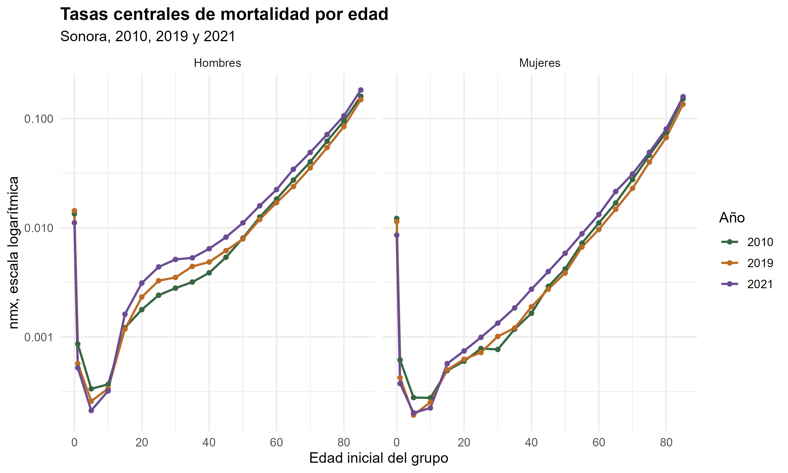
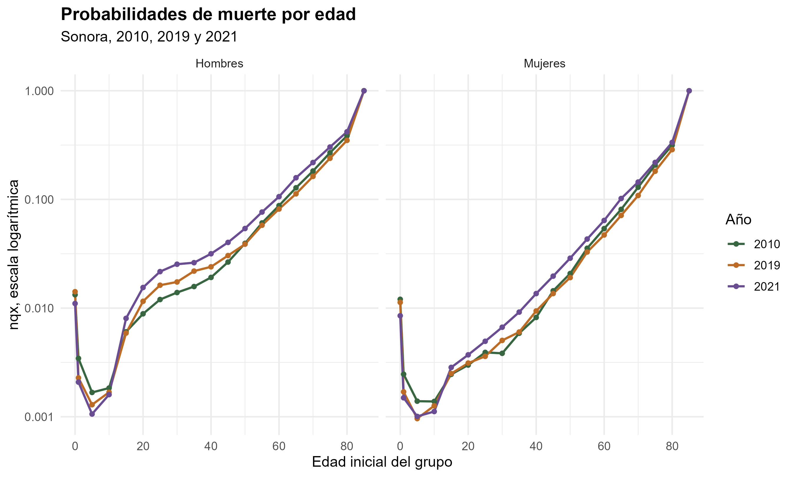
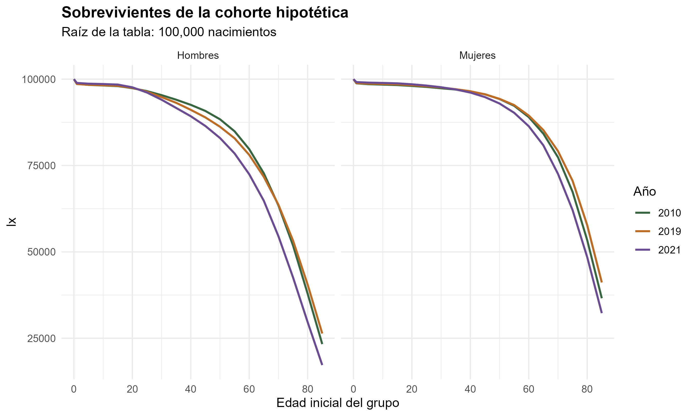
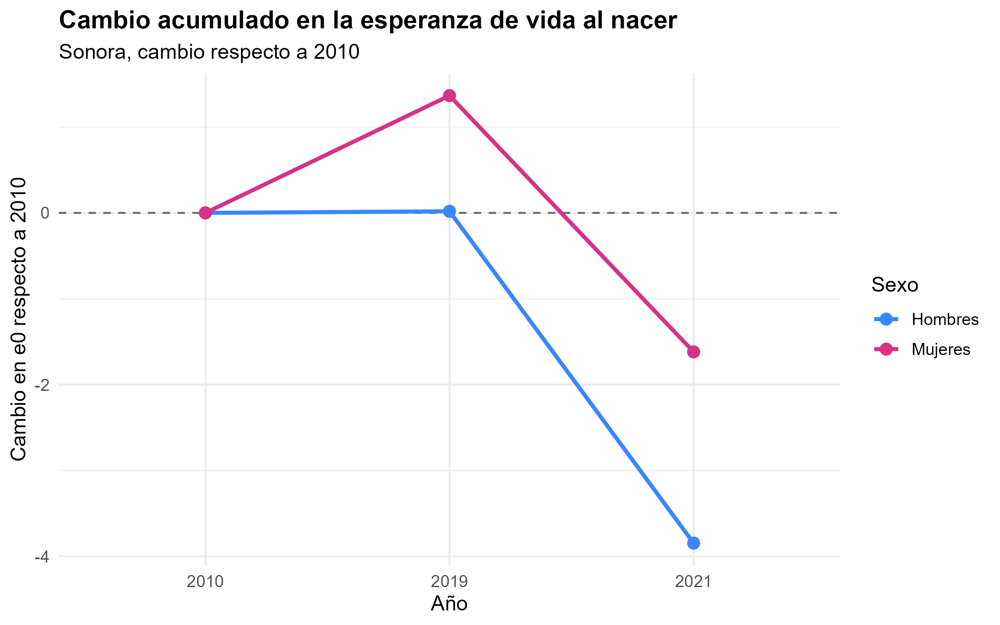
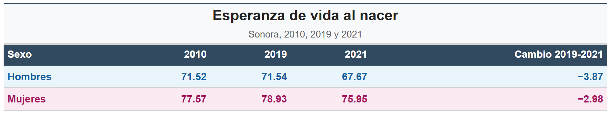

# Sonora, Efecto de la COVID-19 en la esperanza de vida

## Descripción

Este repositorio contiene el proyecto final de Demografía para la construcción de tablas de vida de Sonora en los años 2010, 2019 y 2021, separadas por sexo.

El objetivo principal es estimar la esperanza de vida al nacer, comparar su evolución en el tiempo y observar el efecto de la COVID-19 sobre la mortalidad en 2021.

## Integrantes

-   Aldo Daniel Castañeda González
-   Saúl Valdiviezo Velazco

## Organización del proyecto

``` text
README.md
Proyecto_Final_Sonora/
├── Proyecto_Final_Sonora.qmd
├── Proyecto_Final_Sonora.pdf
├── data/
├── script/
└── output/
```

## Carpetas principales

-   `data/`: contiene los archivos de población y defunciones utilizados en el proyecto.
-   `script/`: contiene el código en R para limpiar datos, calcular tablas de vida y generar resultados visuales.
-   `output/`: contiene las gráficas y tablas generadas para el informe.

Dentro de `output/` se tienen dos carpetas:

``` text
output/
├── graficas/
└── tablas_vida/
```

-   `graficas/`: contiene las gráficas de mortalidad, sobrevivencia y esperanza de vida.
-   `tablas_vida/`: contiene imágenes de las tablas de vida construidas y el resumen de esperanza de vida.

## Fuentes de datos

Los datos utilizados provienen de INEGI.

-   **Población:** Censo de Población y Vivienda 2010 y 2020.
-   **Defunciones:** Estadísticas de Defunciones Registradas.

Las defunciones se trabajaron usando el año de ocurrencia, edad, sexo y entidad correspondiente.

## Metodología general

El procedimiento seguido fue:

1.  Lectura y limpieza de los datos de población.
2.  Agrupación de edades en formato de tabla de vida abreviada.
3.  Prorrateo de población con edad no especificada.
4.  Lectura y limpieza de defunciones.
5.  Uso del año de ocurrencia para las defunciones.
6.  Prorrateo de defunciones con sexo no especificado.
7.  Construcción de defunciones promedio para los años de referencia.
8.  Estimación de APV mediante crecimiento exponencial.
9.  Cálculo de tasas centrales de mortalidad.
10. Construcción de tablas de vida.
11. Obtención de esperanza de vida al nacer.
12. Generación de gráficas y tablas visuales.

Los años de referencia para defunciones se construyeron de la siguiente forma:

``` text
2010 = promedio de 2009, 2010 y 2011
2019 = promedio de 2018 y 2019
2021 = promedio de 2020, 2021 y 2022
```

## Scripts utilizados

El proyecto se reproduce corriendo los scripts en este orden:

``` r
source("script/01_preparacion_datos.R")
source("script/02_tablas_vida.R")
source("script/03_visualizacion.R")
```

### `01_preparacion_datos.R`

Este script carga los paquetes, define rutas, lee los archivos de población y defunciones, limpia las bases y deja listos los objetos:

``` text
poblacion
defunciones
```

### `02_tablas_vida.R`

Este script calcula los APV, las tasas centrales de mortalidad y construye las tablas de vida para los años 2010, 2019 y 2021 por sexo.

Los principales objetos generados son:

``` text
apv
base_mortalidad
tabla_vida
esperanza_vida
```

### `03_visualizacion.R`

Este script genera las gráficas principales y las tablas visuales que se usan en el informe final.

## Resultados generados

El proyecto construye seis tablas de vida:

``` text
2010 Hombres
2010 Mujeres
2019 Hombres
2019 Mujeres
2021 Hombres
2021 Mujeres
```

También se genera un resumen de esperanza de vida al nacer por sexo y año.

## Gráficas principales

Las gráficas del proyecto se encuentran en:

``` text
output/graficas/
```

Se incluyen, entre otras:

-   tasas centrales de mortalidad;
-   probabilidades de muerte;
-   sobrevivientes de la cohorte hipotética;
-   defunciones de la cohorte;
-   cambio acumulado en esperanza de vida.

Algunas salidas principales son:









## Tablas visuales

Las tablas visuales se encuentran en:

``` text
output/tablas_vida/
```

Ahí se guardan las tablas de vida por año y sexo, además del resumen de esperanza de vida al nacer.

Ejemplo:



## Informe final

El informe principal se encuentra en el archivo Quarto:

``` text
Proyecto_Final_Sonora.qmd
```

El PDF generado corresponde a:

``` text
Proyecto_Final_Sonora.pdf
```

El informe incluye:

-   contexto de Sonora;
-   diagrama de flujo;
-   fórmulas utilizadas;
-   código principal;
-   cuadro de esperanza de vida;
-   gráficas;
-   análisis de resultados.

## Nota final

El repositorio está organizado para que el proyecto pueda revisarse y reproducirse desde RStudio. Los datos se encuentran en `data/`, el código en `script/` y las salidas finales en `output/`.
